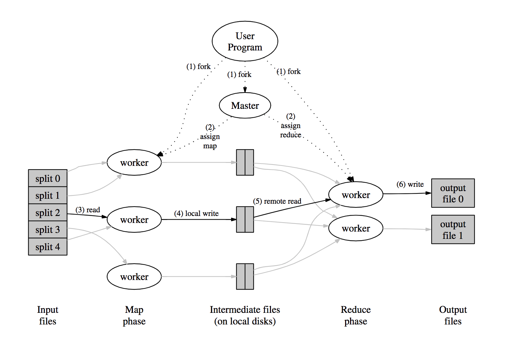

## MR论文

谷歌2004年推出的分布式计算模型MapReduce，用户只需自定义2个数据的处理函数:

- 如何分割原始数据：Map Func
- 如何聚合中间数据：Reduce Func

之后可以用MR模型通过加节点来提高计算效率，关于节点容错、数据分发、负载均衡的问题MR都已处理。

Lab1就是用Go实现MapReduce框架，实现分布式（fake,在单机上使用RPC来实现）调用word count。

### MR应用实例

对文本文件中的单词计数，论文中MR内部处理的伪代码如下

```Python
//MR处理的数据是K-V结构
//key是文件名，value是整个文件的内容，对于空格分割的每个单词进行计数"1"操作
map(String key, String value):
	for each word w in value:
		EmitIntermediate(w, "1");

//对每个单词key都进行词频累加
reduce(String key, Iterator values):
  //key: a word
  //values: a list of counts
	int result = 0;
	for each v in values:
		result += ParseInt(v);
  Emit(AsString(result));
```

MR内部隐藏了Map操作后将计数结果写入中间文件，Reduce操作从中间文件读取计数信息的细节。只需要用户自己实现Map/Reduce的逻辑，即可将任务分布式并行化来大幅提升效率


### MR的数据结构

MR面向的输入输出数据都是k-v结构，其中k-v约定都是string类型，值kneeing是整个原始文件的内容，也可能是数字，取决于用户自定义的map func和reduce func，这2个函数的关联类型是固定的

```
map (k1, v1) -> list(k2, v2)
reduce(k2, v2) -> list(v2)
```

- map处理raw data，对每个内容点k都生成k-v pair
- reduce对每个k都聚合其list中间数据，最终生成聚合结果


### MR执行流程

运行流程图如下：



- Split：MR将input files分割给M个子数据片段
- Fork：将用户程序fork后运行在多个节点上，整个运行过程会执行M个map task和R个reduce task，节点由一个master和多个worker组成，其中master负责调度空闲的worker来运行task
- Map
  - 被分配到map task的worker先读取子数据片段，再调用Map func来处理原始数据生成的k-v pairs中间数据，并通过分区函数归类到R个子文件中，随后写入本地磁盘
  - map worker将中间文件的存储地址通知master，随后master将R个中间文件分配给reduce worker处理
- Reduce：
  - 被分配到reduce task 的worker使用RPC读取map worker上master给定的中间文件。虽然同一个key会被分区到同一个中间文件，但key与key之间的写入顺序是无需的，所以读取完毕后需对keys统一进行排序，否则输出到output file是无需到，会导致master merge到结果也是无序的
  - 排序完毕后对每个key都调用Reduce func来进行聚合，并将结果输出到对应分区的output file中
- Merge：master等所有的map task和reduce task都执行完毕后，将R个output files进行merge操作，整个分布式计算过程执行结束


### 容错处理

#### worker失效

master会定期向各个worker发送ping心跳包，若在超时时间内收到pong包则认为worker有效，否则标记为失效不可用。MR 会将原来分配到失效 worker 的 task 回收重新分配到其他可用的 worker 上重新执行。值得区分的是：

- map worker 失效后是必须重新运行 map task，因为 worker 崩溃了无法处理本地中间文件的访问请求
- reduce worker 如果失效但已生成聚合文件，通知给了 master 该文件在 GFS 中的位置，就不必重新运行

相比论文中如上第 2 种 worker 容错机制，实际在 lab 中都是出错超时直接将 task 分配给其他 worker 运行，因为 lab 并没有实现 reduce worker 输出结果到 output file 后通知 master 的机制。


#### master失效

这种情形论文中只给出了简单的处理方案，即定期将 master 的所有状态作为快照 checkpoint 持久化到磁盘，当 master 崩溃后从最近的 checkpoint 启动新的 master 继续处理。

因为 MR 要求 map func/reduce func 都必须是功能函数，不保留任何状态，即相同的输入能得到相同的输出。所以 master 恢复后继续调度运行是可行的。


### MR 实用技巧

#### 分区函数

在 Map 阶段，使用 `hash(key) mod R` 来保证每个 key 都能汇总到同一中间文件，保证所有 key 尽可能地均匀分布在 R 个中间文件中。

#### 保证顺序

在 Reduce 阶段从中间文件中读取数据时得先排序再聚合，这样聚合到 output files 之间就是分段有序的。


## 实验笔记

### Master

- 初始化：master初始化数据结构，生成map任务放到mapTaskChan中修改当前master为处理map任务状态
- Map状态：当worker来获取任务时，给其分配map任务，每分配一个map任务，就新建一个goroutine来监视map任务的状态，若10s后没有处理完毕，修改map任务状态为idel并且重新放回到mapTaskChan中。当worker汇报map任务完成时，map任务计数器加1，当达到map总数时，修改master状态为reduce状态并生成reduce任务放到reduceTaskChan中
- Reduce状态：当worker来获取任务时，给其分配reduce任务，每分配一个reduce任务，和map一样对其进行监视。worker汇报reduce任务完成时，对计数器进行加1，当达到一定值时，设置done为true，master停止

### Worker

每个worker上线后给master发请求，获取注册id。然后每个worker持续不断地向master获取任务。当master处于map阶段时，获取map任务，处于reduce阶段获取reduce任务。

